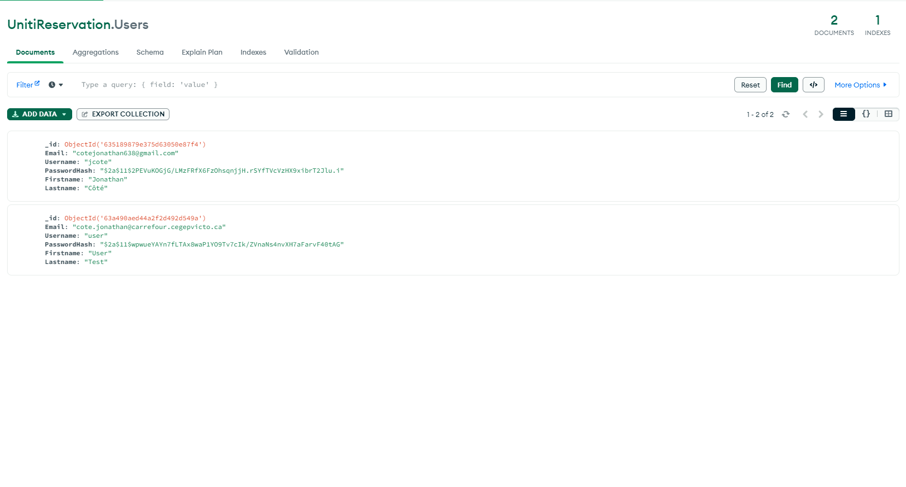
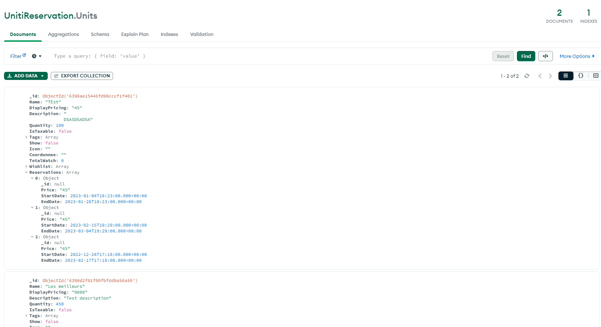
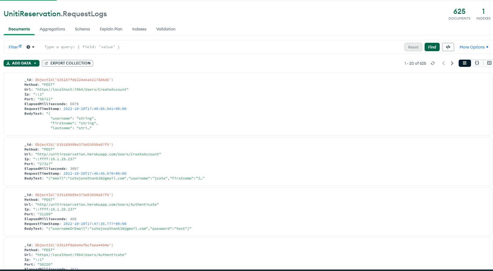

# Application de gestion de locaux

## Description

Ce projet est une application de gestion de locaux. Il permet de gérer les locaux a l'aide de réservations, créer des locaux, etc.

## Procédure d'installation

Installation des dépendances

```bash
npm install
```

Lancement du serveur

```bash
npm run serve
```

Déploiement du serveur

```bash
npm run build
```

## Base de données

La base de données est gérée par MongoDB. Il faut donc installer MongoDB sur votre machine.

### Table User

Regroupe les informations de l'utilisateur avec c'est information d'authentification.



### Table Unit

Regroupe les informations d'un local. (Inclus les réservations)



## Table RequestLogs

Regroupe tous les requêtes effectuées sur l'application.

